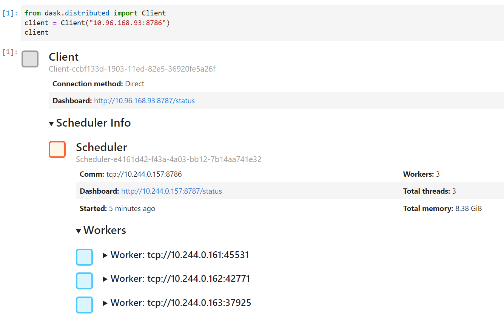
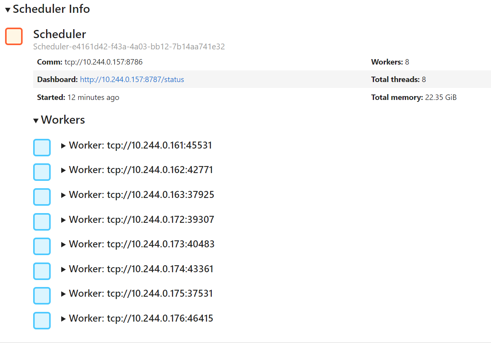

# Rapids Helm Chart

This repository provides an easy entry point to deploy [RAPIDS](https://rapids.ai/index.html) into Kubernetes cluster via helm chart.
Most helm chart templates are derived from [dask/helm-chart](https://github.com/dask/helm-chart).

The following guide includes setting up a scalable rapids environemnt,
demonstrating GPU accelerated notebook workflows and cluster scale up and scale down.

## Quick Setup

Clone the repository, and deploy for single user use:

```
helm install rapids-release rapids/
```

By default, the following pods will be created:
- 3x dask worker pod
    - Each worker pod has 1 GPU. Defined in `worker.resources.requests`.
    - You may change the default worker pods in `worker.replicas`.
- 1x dask scheduler pod
- 1x client pod running jupyter notebook

The following services will be created:
- Services connecting to jupyter notebook pod, exposing at port 80
- Services connecting to dask scheduler dashboard, exposing at port 80 and 8786

Note that no `Ingress` is created.
Custom `Ingress` may be configured to redirect traffic to jupyter notebook,
dask dashboard, webui and pod-monitors (if setup).
See more at [dask/helm-chart](https://github.com/dask/helm-chart).

For this guide, we will setup port forwarding to jupyter notebook via port forwarding.

### Running Rapids Notebook

First, setup port forwarding from the cluster to external port:

```bash
# For Jupyter notebook
kubectl port-forward --address 127.0.0.1 service/rapids-release-dask-jupyter 8888:80 &
# For Dask scheduler
kubectl port-forward --address 127.0.0.1 service/rapids-release-dask-scheduler 8889:80 &
```

For users accessing the notebooks from remote machine,
ssh-tunneling is required.
Otherwise,
open a browser and access `localhost:8888` for jupyter notebook,
and `localhost:8889` for dask dashboard.
Default password for the notebook is `rapids`.

### Notebooks and Cluster Scaling

RAPIDS is a GPU accelerated,
scalable environment suitable for various data science workflow.
`10 Minutes to cuDF and Dask-cuDF`(https://docs.rapids.ai/api/cudf/stable/user_guide/10min.html)
notebook demonstrates using [`cuDF`'s](https://docs.rapids.ai/api/cudf/stable/) pandas-like API
to accelerate the workflow on GPU, and using `dask_cudf`'s dask-dataframe-like API to scale out
the workflow. Be sure to spare the time and walk through the notebook!

<!-- TODO: Image to demonstrate the dashboard is showing the usage of the workers -->

In cluster server,
execute the following to retrieve the IP address of the scheduler:
```
kubectl get svc -l component=scheduler,release=rapids-release
```

```python
from dask.distributed import Client

client = Client(<your-scheduler-ip-address:8786>)
client
```



By default,
we can see 3 workers are scheduled.
Each has 1 GPU assigned.
Assuming your cluster has 8 GPUs to spare,
you may scale up the cluster either via `kubectl` or via `helm upgrade`.

#### via `kubectl`
```bash
kubectl scale deployment rapids-release-worker --replicas=8
```

#### via `helm upgrade`
Modify `worker.replicas` in `values.yaml` to 8, then run
```bash
helm upgrade rapids-release rapids/
```


